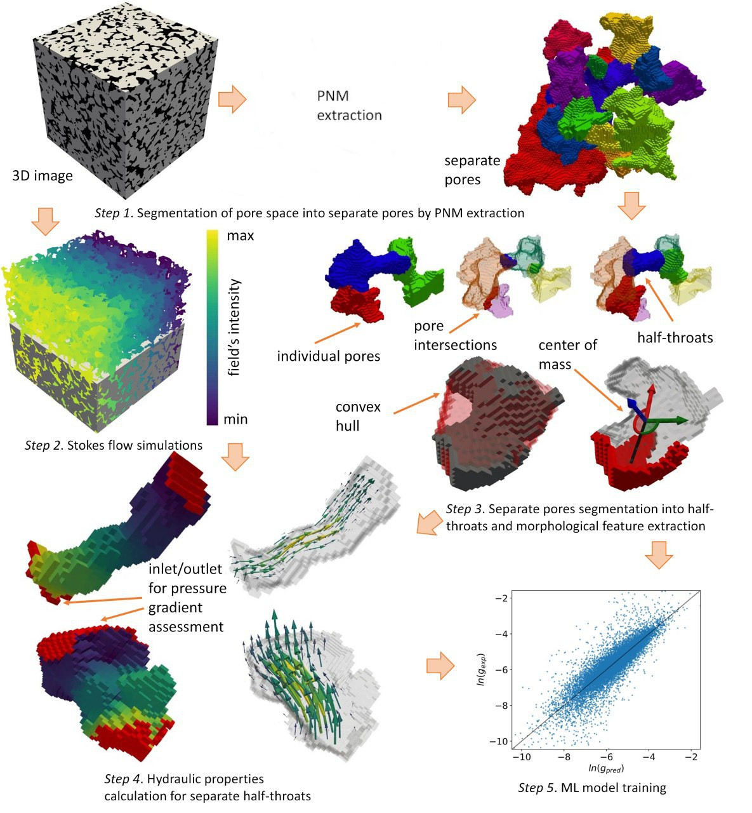

# Графовое представление и моделирование гидродинамики пористых сред

## Достижения и публикации
* 🏆 **10/10 баллов** за доклад «Новый метод определения проницаемости породы при помощи коэффициентов формы» на конференции программы «Научный ментор» (зима 2025-2026).
* 🌍 **Выступлю с докладом** на международной конференции *23rd World Congress of Soil Science (WCSS)* от International Union of Soil Sciences (IUSS), июнь 2026.
* 📝 Статья находится в стадии подготовки к публикации в рецензируемом научном журнале.

*Пайплайн извлечения графовой структуры и геометрических признаков из 3D-воксельного представления. Визуализация выполнена с помощью `Matplotlib`, `PyVista` и `ParaView`.*

## О проекте
Исследовательский проект, посвященный разработке нового эффективного метода предсказания гидродинамических свойств (проницаемости) пористых сред на основе анализа их 3D-геометрии. 

Метод заменяет ресурсоемкие физические симуляции (решение уравнений Стокса) на быстрые предсказания ML-модели, используя специально разработанные масштабно-инвариантные геометрические признаки (шейп-факторы), учитывающие топологию 3D-объектов.

> ⚠️ **Статус кода:** Исходный код репозитория временно закрыт, так как в данный момент ведется написание научной статьи по результатам исследования.

## Вычислительный пайплайн
1. **Обработка 3D-данных:** Сегментация и бинаризация КТ-снимков породы.
2. **Графовое представление:** Выделение центров пор (на базе дискретной теории Морса[^1]) и построение "полупор" (half-throats) для эффективного описания геометрии связей.
3. **Численное моделирование:** Расчет поля скоростей и давлений с помощью Stokes Solver[^2] для получения эталонных гидродинамических параметров.
4. **Алгоритмы геометрии и математика:** Вычисление 3D шейп-факторов (обработка воксельных массивов, расчет моментов инерции, поиск главных осей, морфологическая эрозия).
5. **Machine Learning:** Обучение ансамбля решающих деревьев (XGBoost) для предсказания проводимости системы на основе ее графово-геометрического представления.

## Стек технологий
* **Языки:** Python, Julia (для высокопроизводительного кода расчета шейп-факторов).
* **Научные вычисления и алгоритмы:** NumPy, SciPy, scikit-image.
* **Машинное обучение:** XGBoost, Optuna (подбор гиперпараметров).
* **Визуализация и анализ данных:** Matplotlib (статистика и графики), PyVista (воксельные объекты), ParaView (рендеринг полномасштабных 3D-моделей).

---

## 📚 Источники
[^1]: Zubov, Andrey S., Dmitry A. Murygin, and Kirill M. Gerke. "Pore-network extraction using discrete Morse theory: Preserving the topology of the pore space." Phys. Rev. E 106.5 (2022): 055304.
[^2]: Evstigneev, Nickolay M., Oleg I. Ryabkov, and Kirill M. Gerke. "Stationary Stokes solver for single-phase flow in porous media: A blastingly fast solution based on Algebraic Multigrid Method using GPU." Advances in Water Resources 171 (2023): 104340.
